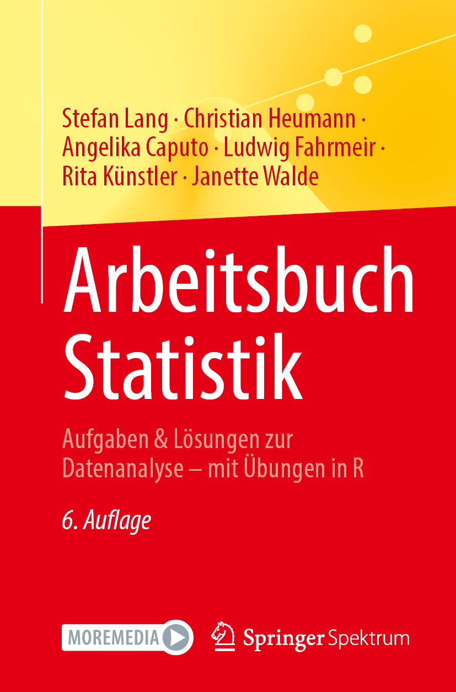
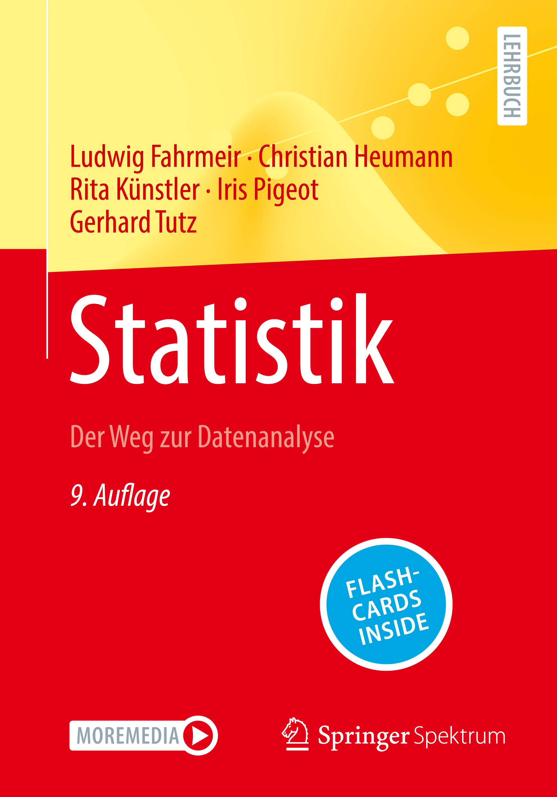

# Statistik-AB-CFHKLW
Hier finden Sie die Datensätze und R-Codes zum [Arbeitsbuch Statistik, 6. Aufl. (Springer Spektrum, 2026)](https://link.springer.com/book/9783662732717) von Stefan Lang, Christian Heumann, Angelika Caputo, Ludwig Fahrmeir, Rita Künstler und Janette Walde.

 

Das Arbeitsbuch ist inhaltlich und strukturell auf das Lehrbuch [*Fahrmeir et al., Statistik, 9. Aufl.*](https://link.springer.com/book/10.1007/978-3-662-67526-7) (Springer Spektrum, 2023) von Ludwig Fahrmeir, Christian Heumann, Rita Künstler, Iris Pigeot und Gerhard Tutz abgestimmt: Alle 99 Aufgaben aus dem Lehrbuch werden hier ausführlich gelöst und durch Verweise eng mit diesem verknüpft.
